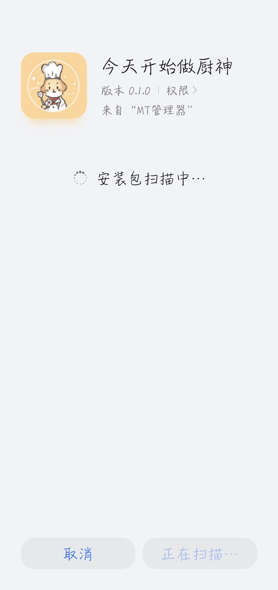
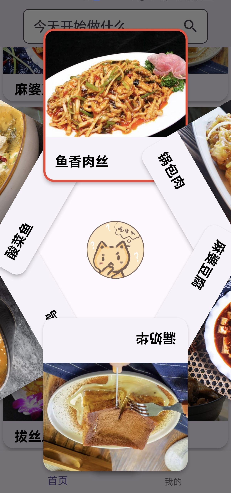
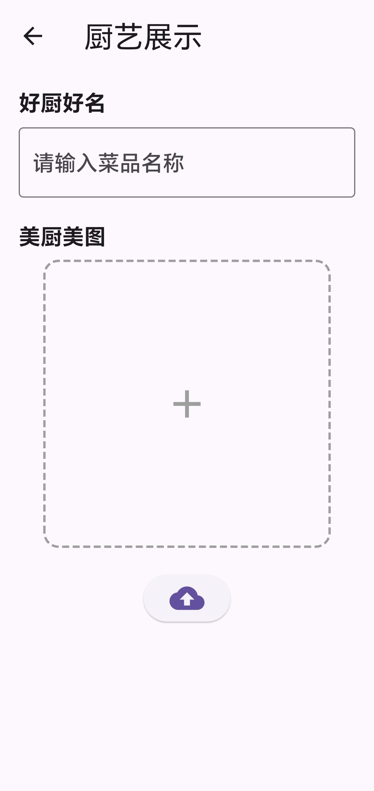
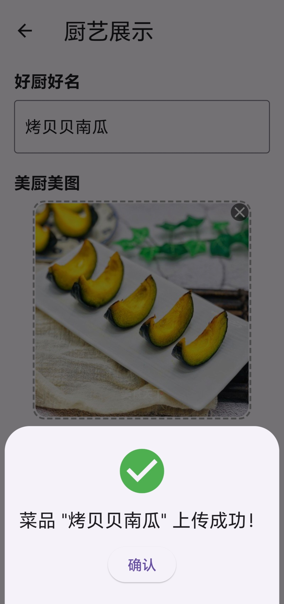

# 今天开始做厨神
全国大学生数字媒体科技作品及创意竞赛-移动应用开发的参赛作品

## 项目简介
基于 Flutter 开发的厨艺分享 App，具有简洁现代的界面和新颖的抽卡功能，利用本地存储模拟了用户上传的功能，且易于迁移至 iOS、Windows 等系统。

## 创意来源
迎合年轻人喜好偏向，通过新颖美观的页面和详细简洁的步骤，勾起年轻人做饭的兴趣：
1. 参考热门游戏玩法增加抽奖功能抽取菜品，增添趣味的同时，解决“吃什么”的烦恼；
2. 参考热门资讯软件，设计更受年轻人青睐的展示界面；
3. 提供菜品成果展示平台，既增添了发布者的成就感，又有利于菜品的增添与创新。

## 作品截图
<table>
<tr>
<td></td>
<td></td>
</tr>
</table>

查看其他截图

<table>
<tr>
<td></td>
<td></td>
<td></td>
</tr>
<tr>
<td></td>
<td></td>
<td></td>
</tr>
<tr>
<td></td>
<td></td>
<td></td>
</tr>
</table>

## 致谢
感谢我最好的贝贝 [@哒哒小蛋挞](https//github.com/BBei10) 在我 coding 的几天内给我的支持与鼓励，没有她提供的的绝佳创意和精心绘制的图标以及“吃什么”表情，我没法在这么短的时间内完成这个 App 的大部分开发。
